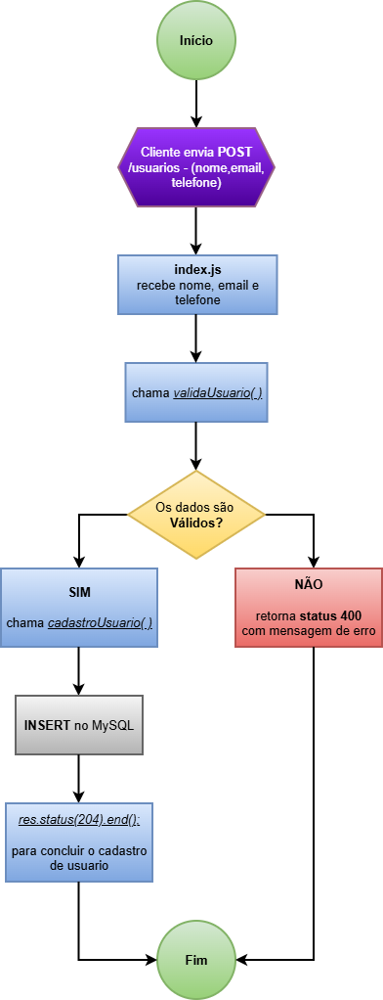
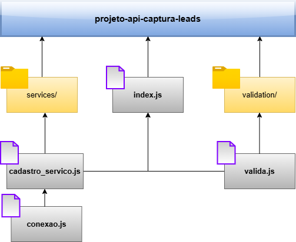

# projeto-api-clinica -  Projeto [DevMedia](https://www.devmedia.com.br)

**22º Projeto**: Esse projeto é uma API REST feita com JavaScript, Node.js, Express e com MySql que insere dados em uma lista de leads.

## 🛠 Tecnologias

### Back-end:
- Node.js
- Express
- JavaScript
- MySql

### Front-end:
- React
- Next.js
- JavaScript
- CSS
- Axios

## 📂 Documentação do Projeto

Os documento de fluxo e de componente estão no arquivo:

### Fluxograma:
;

### Componentes da API:
;

## Detalhes:
Projeto simples, front e back no mesmo, sem postar a api. mais pra teste, se for abrir o projeto não serão inseridos dados no MySQL.